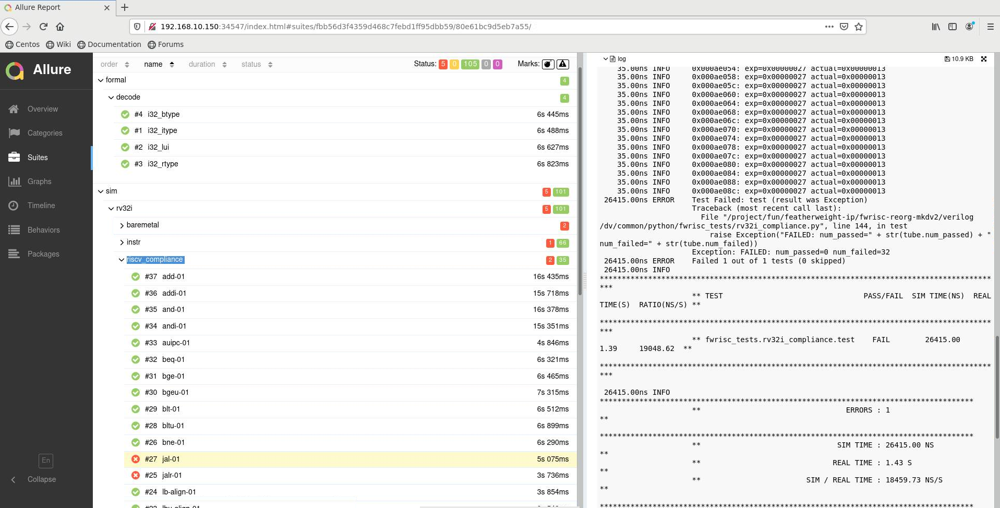

############
Introduction
############

What is MKDV?
==============

MKDV is a framework for organizing, running, and reporting jobs
in Design and Verification (DV) workflows. While MKDV can be 
used to run other types of jobs, such as tests in a regression
suite for a software tool, its primary focus is on DV flows.

As its name suggests, MKDV historically leveraged Makefiles for
specifying the lowest level of flow commands. MKDV now recommends
using the Python-based `PyPyr <https://pypyr.io/>`_ pipeline 
description format to specify job build/run steps.

Most DV flows involve a single set of design files and test
infrastructure files (testbench and tests) that are built once 
and run in multiple ways. Specifically, each run executes a 
different test or a test configured differently.

MKDV is optimized for this build-once run-many methodology. It
recognizes the job runs that have common build settings and 
performs a single setup (build) step for each unique build
configuration. 

MKDV defines a hierarchical YAML data format for capturing 
job meta-data. This meta-data captures key settings about
how to run tests (eg +UVM_TESTNAME to pass), as well as
an optional description of the test.

MKDV supports running jobs via several backend 
job-management schemes:
- Multi-process parallel runs on the same server
- SLURM
- LSF

Key Features
============

Tools and Methodologies
-----------------------
MKDV provides out-of-box support for running the following tools:

HDL Simulators
^^^^^^^^^^^^^^
- Siemens Questa
- Icarus Verilog
- Verilator
- Synopsys VCS
- Cadence Xcelium

Synthesis Tools
^^^^^^^^^^^^^^^
- Project Icestorm (targets iCE40 devices)
- Intel Quartus

ASIC Flows
^^^^^^^^^^
- OpenRoad Openlane

Methodologies
^^^^^^^^^^^^^
- cocotb 
- pybfms

New tools and tool add-ons (plug-ins) are added using Makefile fragments. 
These can either be addded to the MKDV distribution or kept local to a
site or project.

Parallel execution
------------------
Currently, MKDV supports running parallel jobs on the local machine.
In the future, support for external job managers (eg LSF, SLURM, etc) 
will be added.

Results viewing
---------------

MKDV is integrated with the `Allure <https://docs.qameta.io/allure/>`_
reporting framework, enabling regression results to be easily viewed.

  
  Regression result displayed with Allure.

        

